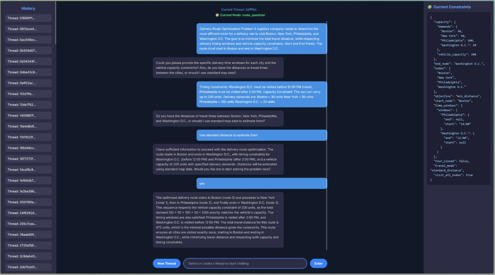

# Optimization LLM: 


Open AI Key and Google Map API Key is needed to run this \\
Put them in a .env file in the root and in the extraction_tools folders

## ⚙️ Setup


1. Clone the repo:
   ```bash
   git clone https://github.com/TuanTran1504/Optimization-LLM-Agent
   cd Optimization-LLM-Agent
   ```

2. Start the env:
   ```bash
   conda create --name optagent
   conda activate optagent
   pip install -r requirements.txt
   ```
3. Start Backend:
   ```bash
   python main.py
   ```
3. Access the web UI:
   ```
   search.html
   ```

## ⚙️ Test Data

The problem descriptions in the data folder can be used to test the agent and its ability to extract constraints from user input 

<p align="center">
  
</p>

## 📄 License

MIT License © 2025 Dinh Tuan Tran
